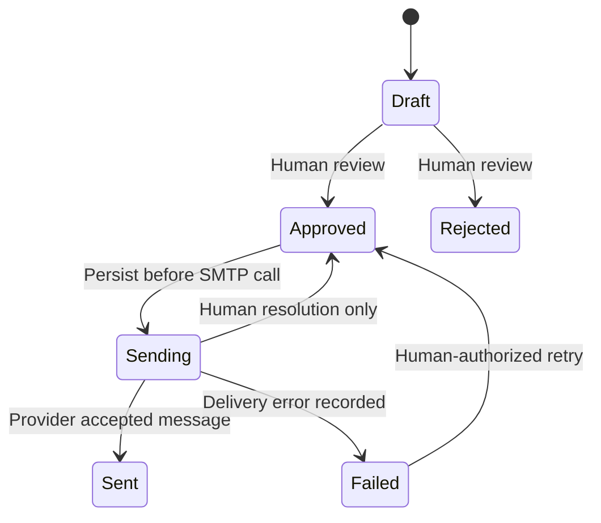

# Architecture

## Workflow

```mermaid
flowchart LR
    A["Official academic and company pages"] --> B["Allowlisted collectors"]
    B --> C["Candidate review table"]
    C -->|"Human sets Approved"| D["Validation gate"]
    D --> E["Invitation draft generator"]
    E --> F["Email draft review table"]
    F -->|"Human sets Approved"| G["Dry-run selection"]
    G -->|"--send plus confirmation"| H["SMTP delivery"]
    H --> I["Sending / Sent / Failed ledger"]
```

## Modules

- `speaker_pipeline.web`: rate-limited official-page client and robots enforcement.
- `speaker_pipeline.academic`: academic directory discovery and profile validation.
- `speaker_pipeline.industry`: senior-leader discovery and official contact-route extraction.
- `speaker_pipeline.common`: canonical table, identity, merge, and workbook helpers.
- `speaker_pipeline.validation`: candidate approval requirements and QA issues.
- `speaker_pipeline.legacy`: migration from the original 11/12-column formats.
- `speaker_pipeline.drafts`: strict template rendering and deterministic Draft IDs.
- `speaker_pipeline.mailer`: dry-run selection, SMTP configuration, delivery, and ledger states.

## Trust Boundaries

Website content is untrusted input. Collectors apply structural checks but never approve a candidate automatically. Human review is the authority for identity, relevance, contact route, and outreach suitability.

The candidate table and draft table are separate approval domains. Candidate approval authorizes draft creation, not delivery. Draft approval authorizes selection for delivery, but SMTP is still disabled unless the operator supplies the live-send flag and exact confirmation phrase.

## Delivery State Machine

`Sending` is deliberately not retried automatically. If the process stops after the provider accepts a message but before `Sent` is saved, automatic retry could create a duplicate.

## Data Files

- `data/candidates.csv` is the canonical candidate record.
- `data/email_drafts.csv` is the canonical draft and delivery ledger.
- XLSX files are review conveniences and are imported back into canonical CSV before live delivery.
- Runtime data and active invitation/company configuration files are ignored by Git.
