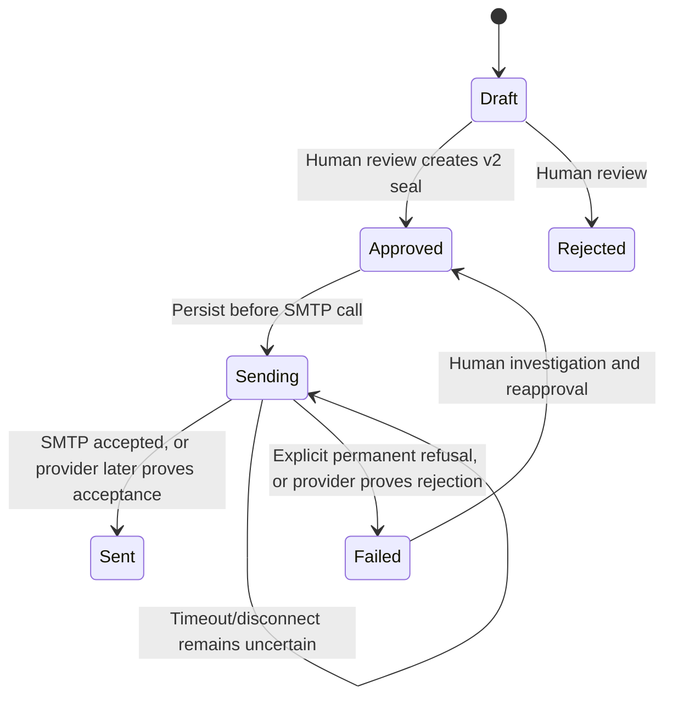

# Architecture

## Objective and Non-Goals

The system supports low-volume, relevant speaker invitations through verified official routes with
human review, global suppression and an auditable SMTP attempt ledger. It does not discover private
mailboxes, run mass outreach, schedule unattended campaigns, retry automatically, monitor inboxes or
prove final delivery.

## Workflow

```mermaid
flowchart LR
    A["Requested people and claimed addresses"] --> B["Allowlisted official-page collection"]
    B --> C["Target report and evidence ledger"]
    C --> D["Accepted current supporting evidence"]
    D --> E["v2-approved candidate"]
    E --> F["Policy- and sender-bound draft"]
    F --> G["Separate v2 draft approval"]
    G --> H["Dry run / offline doctor"]
    H --> I["Five-ledger lock and final preflight"]
    I --> J["Explicitly confirmed TLS SMTP attempt"]
    J --> K["Sending / Sent / Failed ledger"]
    K --> L["Provider-evidence reconciliation when uncertain"]
```

## Modules

- `speaker_pipeline.web`: rate-limited official-page client, robots enforcement, redirect and
  public-address controls.
- `speaker_pipeline.academic` and `speaker_pipeline.industry`: conservative official-site discovery.
- `speaker_pipeline.targets`: campaign policy, requested people and exact claimed-address inputs.
- `speaker_pipeline.evidence`: independent identity, role, email and mailbox assertions.
- `speaker_pipeline.targeted`: one terminal research result per requested target.
- `speaker_pipeline.validation`: fail-closed candidate/evidence requirements.
- `speaker_pipeline.approvals`: backward-readable v1 seals and live-required v2 approval integrity.
- `speaker_pipeline.policy`: campaign window/cap, candidate binding and global-suppression gate.
- `speaker_pipeline.drafts`: strict rendering and deterministic, candidate/policy/sender-bound drafts.
- `speaker_pipeline.mailer`: dry-run default, global recipient-attempt checks and conservative SMTP
  state transitions.
- `speaker_pipeline.locking`: deterministic cross-process locks for canonical ledgers.
- `speaker_pipeline.legacy`, `speaker_pipeline.review`, and `speaker_pipeline.common`: migration,
  reviewed-table merges and canonical CSV/XLSX handling.

## Trust and Approval Boundaries

Website content is untrusted. Every redirect must remain on the configured allowlist and every live
hostname must resolve only to public addresses. Collection never approves a target.

Requested identity, current role, exact-address evidence, contact ownership and mailbox outcome are
separate assertions. Targeted approval requires evidence belonging to the same campaign, target and
candidate, with `Review Status = Accepted`, `Claim Polarity = Supports`, the exact claim value and
the required current temporal status. Historical targets require explicit campaign permission;
deceased targets are ineligible. Live policy also requires Campaign `Research As Of`, Candidate
`Role As Of`, and identity/role/email evidence confirmed or retrieved no earlier than Research As
Of and inside any evidence effective-date interval.

Candidate and draft approvals are separate. A live-eligible v2 draft seal covers its reviewer/time,
message and recipient plus the exact candidate-approval hash, complete campaign-policy hash and
Sender Email/Name/Reply-To. Legacy v1 approvals remain readable for migration but cannot send.

## Live Delivery Contract

Live delivery is permitted only when all of the following remain true:

1. Exactly one matching campaign is `Active`, today is inside its outreach window and
   `Max Messages` is positive and not exceeded by prior plus selected attempts.
2. Candidate and draft v2 approvals are valid and the referenced accepted evidence still passes.
3. Candidate, campaign policy, recipient, route and runtime sender identity still match the draft.
4. No active email/domain/target/candidate suppression matches.
5. No duplicate or earlier attempted recipient exists in the canonical delivery history.
6. The explicit draft, campaign, candidate, evidence and suppression files are all held under locks.
7. The policy is run again in the mailer's final preflight before SMTP is opened.
8. TLS settings, `--send`, the campaign ID and `SEND_APPROVED_EMAILS` confirmation are present.

This is a manual command contract, not a scheduler API.

## Delivery State Machine

`Sent` means SMTP acceptance only. It does not establish inbox placement, reading or reply. A
timeout may happen after provider acceptance, so an ambiguous exception remains durably `Sending`
and the batch stops. `scripts/reconcile_delivery.py` may resolve it only from provider-side evidence;
there is no automatic retry.

## Canonical Data

- `config/campaigns.csv`: live campaign authorization and cap.
- `data/candidates.csv`: reviewed candidate records.
- `data/evidence.csv`: append-oriented source assertions.
- `data/suppressions.csv`: global email/domain/target/candidate do-not-contact controls.
- `data/email_drafts.csv`: reviewed messages and delivery-attempt ledger.
- `config/industry_targets.csv`, `config/email_claims.csv`, and
  `config/email_evidence.csv`: research inputs, not delivery authorization.
- `outputs/industry_target_report.csv`: one terminal row per requested target.
- XLSX files are review conveniences; canonical CSV files control live delivery.

`create_workspace.py` initializes active industry-outreach tables empty and creates only a non-authorizing
Draft campaign with `Max Messages = 0`. It copies a placeholder invitation template, but no example
recipient/research rows or boss-test rows. The named boss/CEO development fixture is excluded from
the package/release manifest.
